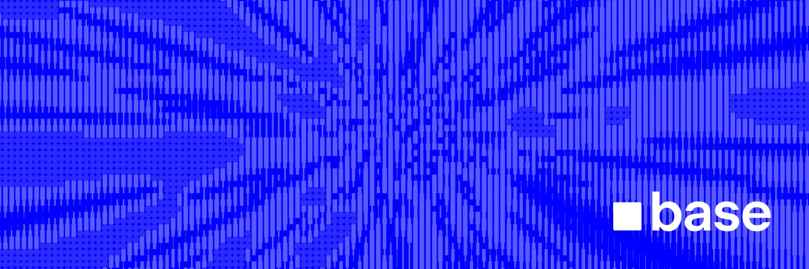

# Base Demo Applications

A repository of demo applications that utilize Base and Coinbase Developer Platform products.

<!-- Badge row 1 - status -->

<!-- Badge row 2 - links and profiles -->

<!-- Badge row 3 - detailed status -->

## Overview

This repository contains example applications demonstrating various [Base] and [Coinbase Developer Platform] features. Each demo is designed to be simple, educational, and ready to run.

## Available Demos

### Base Account

| Demo Name | Location | Description |
|-----------|----------|-------------|
| **Agent Spend Permissions** | `base-account/agent-spend-permissions/` | AI-powered Zora coin purchasing with Base Account spend permissions and gas-free transactions |
| **Auto Sub Accounts** | `base-account/auto-sub-accounts/` | Sub Accounts integration with automatic sub account creation and USDC transfers on Base Sepolia |
| **Base Pay Amazon** | `base-account/base-pay-amazon/` | Chrome extension and checkout app that adds Base Pay to Amazon product pages |
| **Privy Template** | `base-account/base-account-privy-template/` | Next.js starter template for building on Base with Privy authentication and wallet infrastructure |
| **RainbowKit Template** | `base-account/base-account-rainbow-template/` | Next.js template for integrating Base Account with RainbowKit wallet connections |
| **Reown Template** | `base-account/base-account-reown/` | Reown AppKit example using wagmi with Next.js App Router |
| **Thirdweb Template** | `base-account/base-account-thirdweb-template/` | Next.js template with Thirdweb authentication using Email OTP and Base Account wallet |
| **Wagmi Template** | `base-account/base-account-wagmi-template/` | Next.js project bootstrapped with create-wagmi for Base Account integration |

### Base App Coins

| Demo Name | Location | Description |
|-----------|----------|-------------|
| **Base App Coins** | `base-app-coins/` | Index and load metadata for Uniswap v4 pools related to coins created via the Base App |

### Paymaster

| Demo Name | Location | Description |
|-----------|----------|-------------|
| **Hangman Onchain** | `paymaster/hangman-onchain/` | Classic hangman game with onchain win recording using Coinbase CDP |
| **Lingos Game** | `paymaster/onchain-game-lingos/` | Phrase completion game testing knowledge of international phrases and expressions |

### Mini Apps — Workshops

| Demo Name | Location | Description |
|-----------|----------|-------------|
| **Mini App Route** | `mini-apps/workshops/mini-app-route/` | Basic Next.js mini app template with routing examples |
| **Mini App Wrapped** | `mini-apps/workshops/mini-app-wrapped/` | Simple Next.js mini app with MiniKit provider wrapper |
| **Mini Neynar** | `mini-apps/workshops/mini-neynar/` | MiniKit template with Neynar API integration for Farcaster data |
| **Mini Zora** | `mini-apps/workshops/my-mini-zora/` | MiniKit template integrated with Zora protocol for NFT interactions |
| **Simple Mini App** | `mini-apps/workshops/my-simple-mini-app/` | Basic MiniKit template with essential features and notifications |
| **Three Card Monte** | `mini-apps/workshops/three-card-monte/` | Interactive card game mini app with onchain rewards and leaderboard |

### Mini Apps — Templates

| Demo Name | Location | Description |
|-----------|----------|-------------|
| **Full Mini App Demo** | `mini-apps/templates/farcaster-sdk/mini-app-full-demo/` | Comprehensive mini app demo showcasing all functionality available in Base App |
| **Full Mini App Demo (MiniKit)** | `mini-apps/templates/minikit/mini-app-full-demo-minikit/` | Full mini app demo using the MiniKit SDK |
| **Quickstart Mini App** | `mini-apps/templates/minikit/new-mini-app-quickstart/` | Waitlist sign-up mini app built with OnchainKit and Farcaster SDK |
| **Vite Mini App** | `mini-apps/templates/minikit/vite-mini/` | Minimal React + TypeScript + Vite setup for mini app development |

### Mini Apps — Tools

| Demo Name | Location | Description |
|-----------|----------|-------------|
| **Mini App Validator** | `mini-apps/mini-app-validation/` | Read-only validation tool that scans mini app codebases for unsupported patterns |

## Getting Started

1. Clone this repository
2. Navigate to the specific demo directory you want to explore
3. Follow the README instructions in each demo directory

## Requirements

- Node.js (v16 or higher)
- npm or yarn
- A Base-compatible wallet (like Coinbase Wallet)

## Contributing

Contributions are welcome! Please feel free to submit a Pull Request.

## License

This project is licensed under the terms of the included LICENSE file.

---

[Coinbase Developer Platform]: https://portal.cdp.coinbase.com
[Base]: https://base.org
